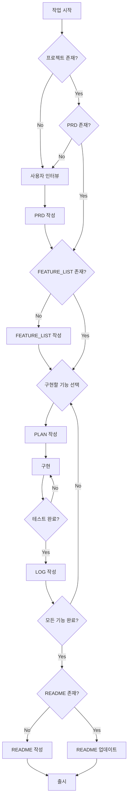

# 📋 Antigravity Documentation Workflow

이 문서는 프로젝트의 작업 흐름, 문서 관리, 폴더 구조에 대한 세부 절차를 정의한다.

## 1. 폴더 구조 (Directory Structure)

```
project-root/
├── README.md                    # ⭐ 프로젝트 완료 후 작성
├── PRD.md                       # 요구사항 정의 (Inbox에서 이동)
├── docs/
│   ├── 00_Inbox/               # 진행 중 문서
│   │   ├── PRD.md              # (작업 중)
│   │   ├── FEATURE_LIST_{날짜}.md
│   │   ├── PLAN_{날짜}_{기능명}.md
│   │   └── ...
│   ├── 01_Completed/           # 완료 문서
│   │   ├── LOG_{날짜}_{기능명}.md
│   │   ├── PLAN_{날짜}_{기능명}.md
│   │   └── ...
│   ├── 99_Templates/           # 템플릿
│   │   ├── TPL_PRD.md
│   │   ├── TPL_README.md
│   │   ├── TPL_Feature_List.md
│   │   ├── TPL_Mission_Plan.md
│   │   └── TPL_Dev_Log.md
│   ├── ARCHITECTURE.md         # (선택) 복잡한 시스템용
│   ├── API.md                  # (선택) API 문서
│   └── WORKFLOW.md             # 이 문서
└── src/                        # 소스 코드
```

## 2. 문서 생명주기 (Document Lifecycle)

### Phase 0: 프로젝트 없음 → PRD 생성

```
[사용자 요청] → [인터뷰] → [PRD 작성] → [승인]
```

### Phase 1: 기획 → 설계

```
[PRD] → [FEATURE_LIST 작성] → [승인]
```

### Phase 2: 설계 → 구현

```
[FEATURE_LIST] → [PLAN 작성] → [승인] → [구현]
```

### Phase 3: 구현 → 완료

```
[구현 완료] → [테스트] → [LOG 작성] → [문서 아카이브]
```

### Phase 4: 출시 준비

```
[모든 기능 완료] → [README 작성] → [최종 리뷰] → [출시]
```

## 3. 작업 유형별 프로세스 (Process by Task Type)

### Type A: 주요 기능 개발 (Major Feature)

> **적용:** 새로운 프로젝트 시작, 새로운 기능 추가, 대규모 리팩토링
> **핵심:** 문서를 한 번 읽으면 컨텍스트에 유지하고, 코딩에 집중하라.

---

#### 📍 Step 1: 프로젝트 초기화 및 요구사항 정의

##### 1-1. 기존 문서 확인

```bash
# 다음 파일들의 존재 여부 확인
- PRD.md (루트 또는 docs/00_Inbox/)
- FEATURE_LIST_*.md (docs/00_Inbox/)
```

##### 1-2. 신규 프로젝트: 사용자 인터뷰 및 PRD 작성

**⚠️ README는 작성하지 않는다!**

**인터뷰 질문 (순차적 진행):**

1. **프로젝트 기본 정보**
   - "프로젝트명과 프로젝트 유형(웹/모바일/데스크톱/API/라이브러리)을 알려주세요."
   
2. **문제 정의**
   - "이 프로젝트가 해결하려는 구체적인 문제는 무엇인가요?"
   - "현재 어떤 어려움이 있고, 이 프로젝트로 어떻게 개선되길 원하시나요?"
   
3. **타겟 사용자**
   - "주요 사용자는 누구인가요? (직업, 연령대, 특성 등)"
   - "사용자들이 가장 필요로 하는 것은 무엇인가요?"
   
4. **핵심 기능**
   - "반드시 구현되어야 할 핵심 기능 3~5개를 알려주세요."
   - "각 기능이 필요한 이유는 무엇인가요?"
   
5. **기술 스택**
   - "사용할 기술 스택이 정해져 있나요? (없으면 '미정' 또는 추천 요청)"
   
6. **제약사항 및 우선순위**
   - "일정, 예산, 기술적 제약사항이 있나요?"
   - "가장 중요한 것과 타협 가능한 것을 구분해주세요."
   
7. **성공 기준**
   - "프로젝트가 성공했다고 판단할 수 있는 기준은 무엇인가요?"

**인터뷰 결과 기반 문서 작성:**

- **템플릿**: `docs/99_Templates/TPL_PRD.md`
- **생성 위치**: `docs/00_Inbox/PRD.md`
- **작성 내용**:
  - Executive Summary
  - 문제 정의
  - 타겟 사용자 및 페르소나
  - 기능 요구사항 (P0/P1/P2 분류)
  - 비기능 요구사항
  - 성공 지표
  - 제약사항 및 리스크

**승인 프로세스:**
```
[PRD 작성 완료] → [사용자에게 제시] → [피드백 반영] → [최종 승인]
```

##### 1-3. 기존 프로젝트: PRD 검토 및 보완

- PRD가 이미 존재하면 내용 검토
- 불충분하면 사용자와 추가 인터뷰 진행
- 필요시 PRD 업데이트 후 승인

---

#### 📍 Step 2: 기능 분해 및 FEATURE_LIST 작성

**⚠️ 여전히 README는 작성하지 않는다!**

##### 2-1. FEATURE_LIST 생성

- **기반 문서**: 승인된 PRD.md
- **템플릿**: `docs/99_Templates/TPL_Feature_List.md`
- **생성 위치**: `docs/00_Inbox/FEATURE_LIST_{YYYYMMDD}.md`

##### 2-2. 작성 내용

1. **기능 목록 테이블**
   ```markdown
   | ID | 기능명 | 우선순위 | 상태 | 담당 PLAN | 완료일 |
   |----|--------|----------|------|-----------|--------|
   | F001 | 사용자 인증 | P0 | in-progress | PLAN_20240115_auth.md | - |
   ```

2. **기능별 상세 정보**
   - 기능 설명
   - 사용자 스토리
   - 인수 조건
   - 의존성

3. **우선순위 매트릭스**
   - Impact (영향력)
   - Effort (노력)
   - Risk (위험도)

**승인 프로세스:**
```
[FEATURE_LIST 작성] → [사용자 검토] → [우선순위 조정] → [승인]
```

---

#### 📍 Step 3: 구현 계획 수립 (PLAN 작성)

##### 3-1. PLAN 생성 시점

- FEATURE_LIST에서 다음 구현할 기능 선택
- 기술적 설계가 명확해진 시점

##### 3-2. PLAN 파일 생성

- **템플릿**: `docs/99_Templates/TPL_Mission_Plan.md`
- **생성 위치**: `docs/00_Inbox/PLAN_{YYYYMMDD}_{기능명}.md`
- **명명 규칙**: 날짜 + 기능명 (예: `PLAN_20240115_user_auth.md`)

##### 3-3. 작성 내용

**메타데이터:**
```yaml
---
mission: "사용자 인증 시스템 구현"
feature_id: F001
status: #status/in-progress
priority: P0
created: 2024-01-15
updated: 2024-01-15
---
```

**구현 계획:**
- Phase 단위로 작업 분할
- 각 Phase별 체크리스트
- 예상 소요 시간
- 의존성 및 선행 조건

**예시:**
```markdown
### Phase 1: 데이터베이스 설계
- [ ] User 테이블 스키마 정의
- [ ] 마이그레이션 파일 작성
- [ ] 테스트 데이터 시딩

### Phase 2: API 구현
- [ ] 회원가입 엔드포인트 (/api/auth/register)
- [ ] 로그인 엔드포인트 (/api/auth/login)
- [ ] JWT 토큰 생성 로직
```

**승인 프로세스:**
```
[PLAN 작성] → [사용자 검토] → [기술적 타당성 확인] → [승인] → [구현 시작]
```

---

#### 📍 Step 4: 구현 (Implementation)

##### 4-1. 컨텍스트 기반 구현

**원칙:**
- PLAN을 **한 번 읽어 컨텍스트에 로드**
- 구현 중에는 **PLAN 파일을 재조회하지 않음**
- "다음 할 일"을 확인하기 위해 문서를 열지 말 것

##### 4-2. 배치 업데이트 규칙

**❌ 금지: 개별 체크리스트 업데이트**
```markdown
# 나쁜 예: 체크리스트 1개마다 파일 수정
- [x] User 테이블 스키마 정의  ← 파일 수정 1회
(코딩 계속...)
- [x] 마이그레이션 파일 작성    ← 파일 수정 2회 (비효율!)
```

**✅ 권장: Phase 단위 배치 업데이트**
```markdown
# 좋은 예: Phase 1 전체 완료 후 한 번에 업데이트
### Phase 1: 데이터베이스 설계
- [x] User 테이블 스키마 정의
- [x] 마이그레이션 파일 작성      ← Phase 1 완료 후
- [x] 테스트 데이터 시딩          ← 한 번에 업데이트
```

##### 4-3. 문서 업데이트 순서

> **PLAN → FEATURE_LIST → LOG** 순서를 엄격히 준수

**Phase 완료 시:**
1. **PLAN 업데이트**
   ```markdown
   ### Phase 1: 데이터베이스 설계
   - [x] User 테이블 스키마 정의
   - [x] 마이그레이션 파일 작성
   - [x] 테스트 데이터 시딩
   ```

**모든 Phase 완료 시:**
1. **PLAN status 변경**
   ```yaml
   status: #status/completed
   ```

2. **FEATURE_LIST 업데이트**
   ```markdown
   | F001 | 사용자 인증 | P0 | [x] completed | PLAN_20240115_auth.md | 2024-01-20 |
   ```

**⚠️ 중요: LOG는 아직 작성하지 않음**

##### 4-4. 구현 중 주의사항

- **중간 LOG 작성 금지**: 완료되지 않은 기능은 LOG 대상이 아님
- **README 수정 금지**: 아직 출시 준비가 되지 않음
- **테스트는 사용자에게 위임**: 자동화 테스트 실행 금지

---

#### 📍 Step 5: 테스트 및 검증

##### 5-1. 사용자 테스트 요청

```
[구현 완료] → [사용자에게 테스트 요청] → [피드백 대기]
```

**테스트 안내 내용:**
- 구현된 기능 설명
- 테스트 방법 (실행 명령어, 접근 URL 등)
- 확인 사항 체크리스트

##### 5-2. 피드백 처리

**성공 시:**
- Step 6으로 진행 (LOG 작성)

**실패/수정 필요 시:**
- PLAN에 `## 변경 사항` 섹션 추가
- 수정 후 재테스트

---

#### 📍 Step 6: 완료 처리 (LOG 작성 및 아카이브)

##### 6-1. LOG 파일 작성

**작성 시점:** 테스트 완료 및 승인 후

- **템플릿**: `docs/99_Templates/TPL_Dev_Log.md`
- **생성 위치**: `docs/00_Inbox/LOG_{YYYYMMDD}_{기능명}.md`

**작성 내용:**
```markdown
---
feature_id: F001
feature_name: "사용자 인증 시스템"
completed_date: 2024-01-20
developer: [이름]
---

## 구현 내용
- JWT 기반 인증 시스템 구축
- 회원가입/로그인 API 구현
- 비밀번호 암호화 (bcrypt)

## 주요 변경사항
- User 테이블 생성
- auth.controller.ts 추가
- auth.service.ts 추가

## 기술적 의사결정
- JWT vs Session: JWT 선택 (확장성)
- 암호화: bcrypt (보안성)

## 발견된 이슈 및 해결
- 이슈 1: [설명 및 해결 방법]

## 테스트 결과
- 단위 테스트: 20/20 passed
- 통합 테스트: 5/5 passed

## 다음 단계
- 소셜 로그인 기능 추가 (F002)
```

##### 6-2. 문서 아카이브

**사용자에게 다음 명령 실행 안내:**
```powershell
./scripts/archive_docs.ps1
```

**결과:**
```
docs/00_Inbox/PLAN_20240115_auth.md → docs/01_Completed/
docs/00_Inbox/LOG_20240120_auth.md  → docs/01_Completed/
```

##### 6-3. 커밋 메시지 작성

**형식:**
```
feat(auth): 사용자 인증 시스템 구현

- JWT 기반 인증 추가
- 회원가입/로그인 API 구현
- 비밀번호 암호화 적용

Closes #F001
```

---

#### 📍 Step 7: 출시 준비 (README 작성)

**⚠️ 중요: 이 단계는 모든 핵심 기능 완료 후에만 진행**

##### 7-1. 문서 생성 필요성 판단

**출시 준비 시 생성할 문서 체크리스트:**

**필수 문서:**
- [ ] **README.md** - 모든 프로젝트 필수

**조건부 자동 생성 문서:**
- [ ] **API.md** - API 서버 또는 라이브러리인 경우
- [ ] **ARCHITECTURE.md** - 복잡한 시스템 구조인 경우
- [ ] **DIAGRAMS.md** - 시각적 구조 파악이 필요한 경우
- [ ] **DEPLOYMENT.md** - 배포 과정이 복잡한 경우
- [ ] **CONTRIBUTING.md** - 오픈소스 또는 팀 협업 프로젝트인 경우
- [ ] **SECURITY.md** - 보안이 중요한 프로젝트인 경우

**README 작성 가능 조건:**
- [ ] 모든 P0 기능 구현 완료
- [ ] 테스트 통과
- [ ] 실제 동작하는 코드 존재
- [ ] 설치/실행 방법 확정

##### 7-5. 문서 생성 예시

**프로젝트 예시: E-commerce API**

**자동 판단 결과:**
```
✅ API.md - REST API 20개 엔드포인트
✅ DIAGRAMS.md - 12개 주요 클래스, 복잡한 주문 플로우
✅ ARCHITECTURE.md - 마이크로서비스 (Auth, Order, Payment)
✅ DEPLOYMENT.md - Kubernetes 배포
✅ SECURITY.md - 결제 정보 처리
❌ CONTRIBUTING.md - 내부 프로젝트
```

**생성될 다이어그램:**
1. Class Diagram - User, Order, Product, Payment 도메인 모델
2. Sequence Diagram - 주문 생성 플로우
3. ER Diagram - 8개 테이블 스키마
4. State Diagram - 주문 상태 전이
5. Component Diagram - 3개 마이크로서비스 구조

**사용자 확인 후 일괄 생성:**
```
docs/
├── README.md
├── API.md
├── DIAGRAMS.md        ← 새로 생성
├── ARCHITECTURE.md
├── DEPLOYMENT.md
└── SECURITY.md
```

- **템플릿**: `docs/99_Templates/TPL_README.md`
- **생성 위치**: `README.md` (프로젝트 루트)

**작성 내용:**
1. **프로젝트 소개** (PRD 기반)
   - 한 줄 요약
   - 주요 기능
   - 기술 스택

2. **설치 및 실행** (실제 코드 기반)
   - 사전 요구사항
   - 설치 단계
   - 환경 변수 설정
   - 실행 명령어

3. **사용 방법** (동작하는 코드 기반)
   - 기본 사용 예제
   - API 엔드포인트
   - 스크린샷/데모

4. **문서 링크**
   - API 문서
   - 아키텍처 문서
   - 기여 가이드

5. **트러블슈팅** (실제 경험 기반)
   - 자주 발생하는 문제
   - 해결 방법

##### 7-6. README 작성

- **템플릿**: `docs/99_Templates/TPL_README.md`
- **생성 위치**: `README.md` (프로젝트 루트)

**작성 내용:**
1. **프로젝트 소개** (PRD 기반)
   - 한 줄 요약
   - 주요 기능
   - 기술 스택

2. **설치 및 실행** (실제 코드 기반)
   - 사전 요구사항
   - 설치 단계
   - 환경 변수 설정
   - 실행 명령어

3. **사용 방법** (동작하는 코드 기반)
   - 기본 사용 예제
   - API 엔드포인트
   - 스크린샷/데모

4. **문서 구조** (생성된 문서 링크)
   ```markdown
   ## 📚 문서
   
   - [API 문서](./docs/API.md) - REST API 엔드포인트 명세
   - [다이어그램](./docs/DIAGRAMS.md) - 시스템 구조 및 플로우 다이어그램
   - [아키텍처](./docs/ARCHITECTURE.md) - 시스템 설계 및 기술 스택
   - [배포 가이드](./docs/DEPLOYMENT.md) - 환경별 배포 방법
   - [보안 정책](./docs/SECURITY.md) - 보안 관련 정책 및 취약점 제보
   ```

5. **트러블슈팅** (실제 경험 기반)
   - 자주 발생하는 문제
   - 해결 방법

##### 7-7. PRD를 루트로 이동 (선택사항)

기획 문서를 공개하고 싶은 경우:
```powershell
move docs/00_Inbox/PRD.md ./PRD.md
```

---

### Type B: 단순 작업 (Minor Task)

> **적용:** 버그 픽스, 오타 수정, 간단한 UI 변경, 문서 수정

#### 특징

- **No PLAN**: 계획 문서를 생성하지 않음
- **No LOG**: 대부분 로그 생성하지 않음
- **즉시 구현**: 내부 사고(Chain of Thought)로 해결

#### 프로세스

1. **문제 파악**
   ```
   [버그 리포트] → [원인 분석] → [해결 방안 수립]
   ```

2. **즉시 수정**
   - 컨텍스트 내에서 해결 방안 정리
   - 코드 수정
   - 간단한 테스트

3. **커밋**
   ```
   fix(component): 버튼 클릭 이벤트 핸들러 수정
   
   - null 체크 추가
   - 이벤트 버블링 방지
   ```

4. **LOG 작성 (선택)**
   - 복잡한 버그인 경우에만
   - 재발 방지를 위한 기록 필요 시

---

### Type C: 계획 변경 (Plan Modification)

> **적용:** 초기 계획 수립 후 기능 추가/수정/삭제 요청 발생 시

#### 변경 유형별 처리

##### C-1. 기능 추가 (Addition)

**순서: FEATURE_LIST → PLAN**

1. **FEATURE_LIST 업데이트**
   ```markdown
   | F005 | 소셜 로그인 | P1 | planned | - | - |
   ```

2. **변경 이력 기록**
   ```markdown
   ## 변경 이력
   | 날짜 | 유형 | 기능 ID | 변경 내용 | 사유 |
   |------|------|---------|-----------|------|
   | 2024-01-25 | 추가 | F005 | 소셜 로그인 추가 | 사용자 요청 |
   ```

3. **새 PLAN 생성**
   - `PLAN_20240125_social_login.md` 작성
   - Type A 프로세스 따름

##### C-2. 기능 수정 (Modification)

**순서: FEATURE_LIST → PLAN**

1. **FEATURE_LIST 업데이트**
   ```markdown
   | F001 | 사용자 인증 (OAuth 추가) | P0 | in-progress | ... | - |
   ```

2. **변경 이력 기록**
   ```markdown
   | 2024-01-25 | 수정 | F001 | OAuth 인증 추가 | 요구사항 변경 |
   ```

3. **PLAN 업데이트**
   ```markdown
   ## 변경 사항
   
   ### 2024-01-25: OAuth 인증 추가
   **변경 사유**: 사용자 요청으로 Google OAuth 지원 필요
   
   **추가 작업**:
   - [ ] Google OAuth 라이브러리 설정
   - [ ] OAuth 콜백 처리
   - [ ] 사용자 프로필 연동
   ```

##### C-3. 기능 삭제 (Deletion)

**순서: FEATURE_LIST → PLAN**

1. **FEATURE_LIST 업데이트**
   ```markdown
   | F003 | ~~이메일 인증~~ [취소됨] | P1 | cancelled | ... | - |
   ```

2. **변경 이력 기록**
   ```markdown
   | 2024-01-25 | 삭제 | F003 | 이메일 인증 취소 | 우선순위 하향 |
   ```

3. **PLAN status 변경**
   ```yaml
   status: #status/cancelled
   ```

#### 변경 요청 시 필수 규칙

> **⚠️ 금지: PLAN만 수정하고 FEATURE_LIST를 업데이트하지 않는 것**

**올바른 순서:**
```
[변경 요청] → [FEATURE_LIST 업데이트] → [PLAN 업데이트] → [사용자 승인] → [구현]
```

---

## 4. 세션 관리 및 변경 요청

### 4-1. 세션 연속성

**작업 종료 시:**
- PLAN 파일에 다음 작업 명시
- 컨텍스트에서 현재 상태 요약

**다음 세션 시작 시:**
- FEATURE_LIST에서 진행 중인 기능 확인
- 해당 PLAN 파일 로드
- 마지막 체크리스트 확인

### 4-2. 변경 요청 처리

**기존 기능 변경:**
1. 사용자 요청 확인
2. FEATURE_LIST 업데이트
3. PLAN에 `## 변경 사항` 섹션 추가
4. 변경 계획 사용자 승인
5. 구현 진행

**⚠️ 금지: 무단 코드 수정**
- 변경 계획 없이 코드를 먼저 작성하지 마라
- 변경 사유와 영향 범위를 사용자와 합의하라

---

## 5. 파일 관리 스크립트 가이드

### 5-1. 문서 아카이브 스크립트

**사용 시점:** 기능 완료 및 LOG 작성 후

```powershell
# 완료된 모든 문서를 자동으로 이동
./scripts/archive_docs.ps1

# 특정 문서만 이동
./scripts/archive_docs.ps1 -Target "PLAN_user_auth.md"
```

**동작:**
- `status: #status/completed`인 PLAN 파일 탐지
- 해당 PLAN과 LOG를 `docs/01_Completed/`로 이동
- FEATURE_LIST는 `docs/00_Inbox/`에 유지

### 5-2. 문서 상태 확인

```powershell
# 진행 중인 작업 확인
ls docs/00_Inbox/PLAN_*.md

# 완료된 작업 확인
ls docs/01_Completed/LOG_*.md
```

---

## 6. 체크리스트 요약

### 프로젝트 시작 시

- [ ] 사용자 인터뷰 완료
- [ ] PRD 작성 및 승인
- [ ] FEATURE_LIST 작성 및 승인
- [ ] ❌ README 작성 안 함 (출시 전까지 금지)

### 기능 구현 시

- [ ] FEATURE_LIST에서 다음 기능 선택
- [ ] PLAN 작성 및 승인
- [ ] 구현 (컨텍스트 기반, 문서 재조회 금지)
- [ ] Phase 단위 PLAN 업데이트
- [ ] 사용자 테스트
- [ ] LOG 작성
- [ ] 문서 아카이브
- [ ] ❌ README 수정 안 함 (아직 출시 전)

### 출시 준비 시

- [ ] 모든 P0 기능 완료
- [ ] 모든 테스트 통과
- [ ] 실제 동작하는 코드 확인
- [ ] ✅ README 작성 (이제 가능!)
- [ ] 최종 리뷰
- [ ] 배포

---

## 부록: 문서 작성 시점 결정 플로우차트



---

**이 워크플로우는 다음 원칙에 기반합니다:**

1. ✅ **작성 가능한 시점에 작성**: 정보가 충분할 때만 문서 생성
2. ✅ **중복 방지**: 같은 내용을 여러 문서에 반복하지 않음
3. ✅ **효율성**: 컨텍스트 활용으로 불필요한 파일 조회 최소화
4. ✅ **정확성**: 실제 코드 기반으로 README 작성

---
