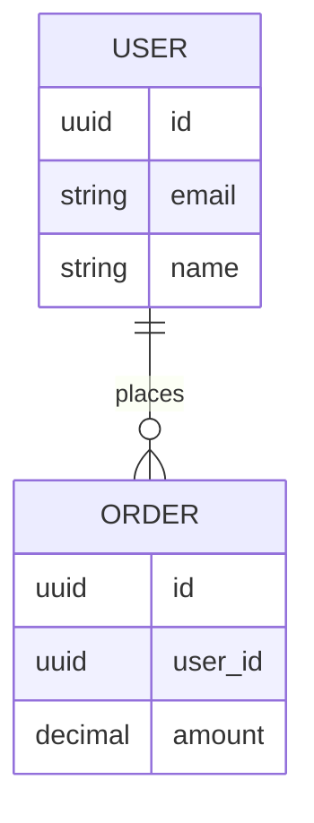
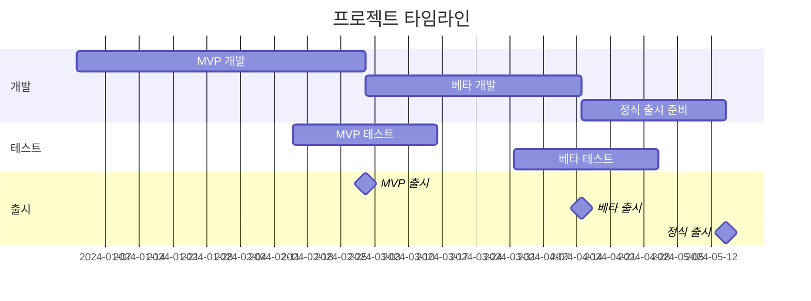
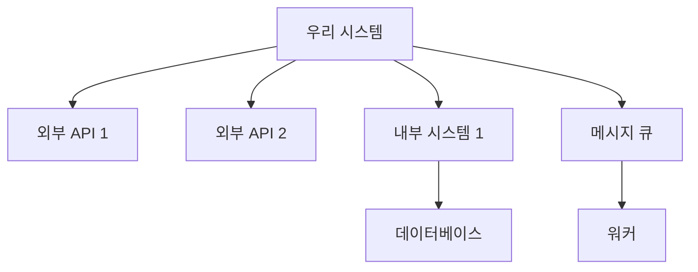

# Product Requirements Document (PRD)

## 문서 정보
- **문서 버전**: v1.0
- **작성일**: [YYYY-MM-DD]
- **최종 수정일**: [YYYY-MM-DD]
- **작성자**: [이름/팀]
- **승인자**: [이름/직책]
- **문서 상태**: [Draft / In Review / Approved / Deprecated]

---

## 📋 목차
1. [프로젝트 기본 정보](#1-프로젝트-기본-정보)
2. [Executive Summary](#2-executive-summary)
3. [문제 정의](#3-문제-정의)
4. [목표 및 성공 지표](#4-목표-및-성공-지표)
5. [타겟 사용자](#5-타겟-사용자)
6. [시장 및 경쟁사 분석](#6-시장-및-경쟁사-분석)
7. [사용자 시나리오](#7-사용자-시나리오)
8. [기능 요구사항](#8-기능-요구사항)
9. [비기능 요구사항](#9-비기능-요구사항)
10. [데이터 요구사항](#10-데이터-요구사항)
11. [기술 스택](#11-기술-스택)
12. [우선순위 및 로드맵](#12-우선순위-및-로드맵)
13. [제약사항 및 리스크](#13-제약사항-및-리스크)
14. [이해관계자](#14-이해관계자)
15. [의존성 및 통합](#15-의존성-및-통합)
16. [참고 자료](#16-참고-자료)

---

## 1. 프로젝트 기본 정보

### 1.1 프로젝트 개요
- **프로젝트명**: [프로젝트 정식 명칭]
- **프로젝트 코드명**: [내부 코드명 (있는 경우)]
- **프로젝트 유형**: [웹 애플리케이션 / 모바일 앱 (iOS/Android) / API 서버 / 데스크톱 앱 / 하이브리드]
- **프로젝트 버전**: [v1.0.0]
- **관련 프로젝트**: [연관된 다른 프로젝트가 있다면 명시]

### 1.2 일정
- **프로젝트 시작일**: [YYYY-MM-DD]
- **목표 출시일**: [YYYY-MM-DD]
- **주요 마일스톤**:
  - MVP 완료: [YYYY-MM-DD]
  - 베타 테스트: [YYYY-MM-DD]
  - 정식 출시: [YYYY-MM-DD]

### 1.3 예산 및 리소스
- **예산**: [예산 범위 또는 "제약 없음" 또는 "비공개"]
- **팀 구성**:
  - PM: [인원 수]
  - 개발자: [인원 수]
  - 디자이너: [인원 수]
  - QA: [인원 수]

---

## 2. Executive Summary

### 2.1 한 줄 요약
[프로젝트를 한 문장으로 설명: 예) 중소기업을 위한 AI 기반 재고 관리 자동화 플랫폼]

### 2.2 배경 및 목적
[이 프로젝트를 시작하게 된 배경과 비즈니스적 맥락을 2-3 문단으로 설명]

**배경**:
- [시장 트렌드, 고객 요구, 비즈니스 기회 등]
- [기존 솔루션의 한계나 문제점]

**목적**:
- [이 프로젝트가 달성하고자 하는 주요 목표]
- [예상되는 비즈니스 임팩트]

### 2.3 비전
[프로젝트가 장기적으로 달성하고자 하는 궁극적인 목표와 가치]

**예시**:
"3년 내에 국내 중소기업의 재고 관리 효율성을 50% 향상시켜 불필요한 재고 비용을 1조원 절감한다."

---

## 3. 문제 정의

### 3.1 해결하고자 하는 문제 (Problem Statement)
[명확하고 구체적으로 문제를 정의]

**현재 상황**:
- [현재 타겟 사용자가 직면한 구체적인 문제]
- [문제의 규모와 빈도]
- [문제로 인한 손실 (시간, 비용, 기회 등)]

**예시**:
"중소 제조업체들은 수작업 재고 관리로 인해 매달 평균 300만원의 재고 손실을 겪고 있으며, 재고 파악에 하루 평균 2시간을 소비하고 있습니다."

### 3.2 문제가 발생하는 이유
- [근본 원인 1]
- [근본 원인 2]
- [근본 원인 3]

### 3.3 문제 해결 시 기대 효과
- [정량적 효과: 예) 재고 관리 시간 80% 단축]
- [정성적 효과: 예) 의사결정 신속성 향상]

---

## 4. 목표 및 성공 지표

### 4.1 비즈니스 목표
1. **[목표 1]**: [구체적인 목표 설명]
2. **[목표 2]**: [구체적인 목표 설명]
3. **[목표 3]**: [구체적인 목표 설명]

### 4.2 성공 지표 (KPI)

#### 핵심 지표 (North Star Metric)
- **지표명**: [가장 중요한 단일 지표]
- **현재 값**: [기준선]
- **목표 값**: [달성하고자 하는 값]
- **측정 방법**: [어떻게 측정할 것인지]

#### 주요 성과 지표
| 지표 | 현재 값 | 목표 값 (3개월) | 목표 값 (6개월) | 측정 주기 |
|------|---------|-----------------|-----------------|-----------|
| MAU (월간 활성 사용자) | - | 1,000명 | 5,000명 | 주간 |
| 사용자 유지율 | - | 60% | 75% | 주간 |
| 일일 평균 사용 시간 | - | 15분 | 25분 | 일간 |
| NPS 점수 | - | 40 | 60 | 월간 |
| 전환율 | - | 5% | 10% | 주간 |

#### 비즈니스 지표
| 지표 | 목표 값 | 측정 시점 |
|------|---------|-----------|
| 매출 | [$X] | [출시 후 6개월] |
| CAC (고객 획득 비용) | [$X] | [월간] |
| LTV (고객 생애 가치) | [$X] | [분기] |
| ROI | [X%] | [연간] |

### 4.3 성공 기준
**출시 기준 (Launch Criteria)**:
- [ ] [기준 1: 예) 핵심 기능 10개 모두 동작]
- [ ] [기준 2: 예) 베타 테스트 사용자 만족도 4.0/5.0 이상]
- [ ] [기준 3: 예) P0/P1 버그 0건]

---

## 5. 타겟 사용자

### 5.1 주요 타겟 세그먼트
- **1차 타겟**: [주요 타겟 그룹]
  - 인구통계: [연령, 지역, 직업 등]
  - 특성: [행동 패턴, 니즈, 페인 포인트]
  - 시장 규모: [예상 사용자 수]

- **2차 타겟**: [부차적 타겟 그룹]
  - 인구통계: [연령, 지역, 직업 등]
  - 특성: [행동 패턴, 니즈, 페인 포인트]
  - 시장 규모: [예상 사용자 수]

### 5.2 사용자 페르소나

#### 페르소나 1: [이름/역할]
```
기본 정보:
- 이름: [가명]
- 나이: [연령대]
- 직업: [직업]
- 거주지: [지역]

배경:
- [직업적 배경, 기술 수준 등]

목표 & 동기:
- [이 사용자가 달성하고 싶은 것]
- [제품을 사용하는 이유]

페인 포인트:
- [겪고 있는 주요 문제 1]
- [겪고 있는 주요 문제 2]

사용 시나리오:
- [언제, 어떤 상황에서 제품을 사용하는지]

기대 가치:
- [이 제품으로부터 얻고자 하는 가치]
```

#### 페르소나 2: [이름/역할]
[페르소나 1과 동일한 형식으로 작성]

### 5.3 사용자 니즈 우선순위
| 니즈 | 중요도 | 긴급도 | 현재 해결 방법 | 해결 수준 |
|------|--------|--------|----------------|-----------|
| [니즈 1] | 높음 | 높음 | [기존 방법] | 불만족 |
| [니즈 2] | 높음 | 중간 | [기존 방법] | 보통 |
| [니즈 3] | 중간 | 낮음 | [기존 방법] | 만족 |

---

## 6. 시장 및 경쟁사 분석

### 6.1 시장 현황
- **시장 규모**: [TAM/SAM/SOM]
  - TAM (Total Addressable Market): [$X]
  - SAM (Serviceable Addressable Market): [$X]
  - SOM (Serviceable Obtainable Market): [$X]

- **시장 트렌드**:
  - [트렌드 1]
  - [트렌드 2]
  - [트렌드 3]

- **성장률**: [연평균 성장률 X%]

### 6.2 경쟁사 분석

#### 직접 경쟁사

**경쟁사 A: [회사명/제품명]**
- **장점**:
  - [강점 1]
  - [강점 2]
- **단점**:
  - [약점 1]
  - [약점 2]
- **시장 점유율**: [X%]
- **가격**: [가격 정책]
- **차별화 포인트**: [우리가 더 나은 점]

**경쟁사 B: [회사명/제품명]**
[경쟁사 A와 동일한 형식]

#### 간접 경쟁사
- [간접 경쟁 솔루션 1]: [설명]
- [간접 경쟁 솔루션 2]: [설명]

### 6.3 경쟁 우위 (Competitive Advantage)
우리 제품이 경쟁사 대비 가지는 핵심 차별점:

1. **[차별점 1]**: [구체적 설명]
2. **[차별점 2]**: [구체적 설명]
3. **[차별점 3]**: [구체적 설명]

### 6.4 진입 장벽
- [우리가 구축할 진입 장벽 1]
- [우리가 구축할 진입 장벽 2]

---

## 7. 사용자 시나리오

### 7.1 핵심 사용자 여정 (User Journey)

#### 시나리오 1: [주요 사용 사례명]
**사용자**: [페르소나명]  
**목표**: [사용자가 달성하고자 하는 것]  
**빈도**: [일일/주간/월간]  
**중요도**: [높음/중간/낮음]

**사용 흐름**:
```
1. [단계 1: 예) 사용자가 로그인한다]
   - 터치포인트: [웹/앱 로그인 페이지]
   - 감정: [기대감]
   - 페인 포인트: [비밀번호 기억 어려움]

2. [단계 2: 예) 대시보드에서 현황을 확인한다]
   - 터치포인트: [대시보드 화면]
   - 감정: [만족/불만]
   - 필요 정보: [실시간 데이터]

3. [단계 3: 예) 작업을 수행한다]
   - 터치포인트: [작업 화면]
   - 감정: [성취감]
   - 예상 소요 시간: [X분]

4. [단계 4: 예) 결과를 확인하고 종료한다]
   - 터치포인트: [결과 화면]
   - 감정: [안도감]
```

**성공 시나리오**:
- [사용자가 목표를 달성했을 때의 결과]

**실패 시나리오**:
- [문제가 발생했을 때의 대응 방법]

#### 시나리오 2: [또 다른 주요 사용 사례]
[시나리오 1과 동일한 형식으로 작성]

### 7.2 사용자 스토리 (User Stories)

**Epic 1: [큰 기능 묶음]**
- **US-001**: As a [사용자 유형], I want to [기능], so that [목적/가치]
  - 인수 조건 (Acceptance Criteria):
    - [ ] [조건 1]
    - [ ] [조건 2]
    - [ ] [조건 3]
  - 우선순위: [P0/P1/P2]
  - Story Point: [추정 크기]

- **US-002**: As a [사용자 유형], I want to [기능], so that [목적/가치]
  - 인수 조건:
    - [ ] [조건 1]
    - [ ] [조건 2]

---

## 8. 기능 요구사항

### 8.1 기능 우선순위 매트릭스

| 기능 | 우선순위 | 비즈니스 임팩트 | 개발 난이도 | 사용자 요청 | v1.0 포함 |
|------|----------|-----------------|-------------|-------------|-----------|
| [기능 1] | P0 | 높음 | 중간 | 90% | ✅ |
| [기능 2] | P0 | 높음 | 높음 | 85% | ✅ |
| [기능 3] | P1 | 중간 | 낮음 | 70% | ✅ |
| [기능 4] | P2 | 낮음 | 중간 | 40% | ❌ |

**우선순위 정의**:
- **P0 (Must Have)**: 출시를 위해 반드시 필요한 기능
- **P1 (Should Have)**: 중요하지만 출시 후 추가 가능
- **P2 (Nice to Have)**: 향후 버전에서 고려

### 8.2 필수 기능 (Must Have - P0)

#### 기능 1: [기능명]
**설명**: [기능에 대한 상세 설명]

**목적**: [왜 이 기능이 필요한지]

**사용자 흐름**:


**상세 요구사항**:
- **입력**: [필요한 입력 데이터와 형식]
- **처리**: [내부 로직 설명]
- **출력**: [결과물과 형식]
- **예외 처리**: [에러 케이스와 처리 방법]

**UI/UX 요구사항**:
- [화면 구성 설명]
- [인터랙션 방식]
- [피드백 방법]

**비즈니스 규칙**:
- [규칙 1: 예) 사용자는 하루 최대 10회 요청 가능]
- [규칙 2]

**인수 조건** (Acceptance Criteria):
- [ ] [조건 1: Given-When-Then 형식 권장]
- [ ] [조건 2]
- [ ] [조건 3]

**의존성**:
- [선행 조건이나 관련 기능]

#### 기능 2: [기능명]
[기능 1과 동일한 형식으로 작성]

#### 기능 3: [기능명]
[기능 1과 동일한 형식으로 작성]

### 8.3 중요 기능 (Should Have - P1)

#### 기능 4: [기능명]
[간략한 설명과 핵심 요구사항만 작성]

#### 기능 5: [기능명]
[간략한 설명과 핵심 요구사항만 작성]

### 8.4 향후 고려 기능 (Nice to Have - P2)

#### 기능 6: [기능명]
- **설명**: [한 문장 설명]
- **예상 효과**: [기대되는 가치]
- **고려 시점**: [v2.0 / 2024 Q3 등]

---

## 9. 비기능 요구사항

### 9.1 성능 (Performance)
- **응답 시간**:
  - 페이지 로드: [< 2초]
  - API 응답: [< 500ms]
  - 검색 결과: [< 1초]
- **처리량 (Throughput)**:
  - 동시 접속자: [최대 10,000명]
  - TPS (초당 트랜잭션): [1,000 TPS]
- **처리 용량**:
  - 데이터 업로드: [최대 100MB]
  - 일일 처리량: [100만 건]

### 9.2 확장성 (Scalability)
- **수평 확장**: [서버 증설로 부하 분산 가능해야 함]
- **수직 확장**: [단일 서버 성능 향상 가능해야 함]
- **데이터 확장**: [연간 [X]배 데이터 증가 대응]
- **사용자 확장**: [1년 내 사용자 [X]배 증가 대응]

### 9.3 가용성 (Availability)
- **목표 가동률**: [99.9% (연간 다운타임 8.76시간 이내)]
- **복구 시간 목표 (RTO)**: [1시간 이내]
- **복구 시점 목표 (RPO)**: [데이터 손실 1시간 이내]
- **백업 정책**: [일일 전체 백업, 시간별 증분 백업]

### 9.4 보안 (Security)
- **인증/인가**:
  - [OAuth 2.0 / JWT 기반 인증]
  - [역할 기반 접근 제어 (RBAC)]
  - [다중 인증 (MFA) 지원]
- **데이터 암호화**:
  - 전송 중 암호화: [TLS 1.3]
  - 저장 데이터 암호화: [AES-256]
  - 민감 정보: [추가 암호화 레이어]
- **개인정보 보호**:
  - [GDPR 준수]
  - [개인정보처리방침 동의 절차]
  - [데이터 삭제 요청 처리]
- **보안 감사**:
  - [정기 보안 점검]
  - [침투 테스트]
  - [취약점 스캔]

### 9.5 호환성 (Compatibility)
- **브라우저 지원**:
  - Chrome: [최신 버전 - 2]
  - Safari: [최신 버전 - 2]
  - Firefox: [최신 버전 - 2]
  - Edge: [최신 버전 - 2]
- **OS 지원**:
  - iOS: [15.0 이상]
  - Android: [10.0 (API 29) 이상]
  - Windows: [10 이상]
  - macOS: [11.0 이상]
- **디바이스**:
  - 데스크톱: [1920x1080 이상]
  - 태블릿: [768x1024 이상]
  - 모바일: [375x667 이상]
- **네트워크**:
  - 최소 속도: [3G 이상]
  - 오프라인 모드: [지원/미지원]

### 9.6 접근성 (Accessibility)
- **표준 준수**: [WCAG 2.1 AA 레벨]
- **필수 기능**:
  - 키보드 네비게이션 완전 지원
  - 스크린 리더 호환
  - 적절한 색상 대비 (최소 4.5:1)
  - 대체 텍스트 제공
- **다국어 지원**:
  - 지원 언어: [한국어, 영어, 일본어 등]
  - 언어별 RTL 지원: [필요 시]

### 9.7 유지보수성 (Maintainability)
- **코드 품질**:
  - 코드 커버리지: [최소 80%]
  - 정적 분석 통과
  - 린트 규칙 준수
- **문서화**:
  - API 문서 자동 생성
  - 주요 로직 주석 작성
  - 아키텍처 문서 유지
- **모니터링**:
  - 로그 수집 및 분석
  - 에러 추적
  - 성능 모니터링

### 9.8 사용성 (Usability)
- **학습 용이성**: [신규 사용자가 [X]분 내에 핵심 기능 사용 가능]
- **작업 효율성**: [기존 대비 [X]% 시간 단축]
- **에러 방지**: [명확한 입력 가이드, 실시간 유효성 검사]
- **에러 복구**: [실행 취소 기능, 명확한 에러 메시지]

---

## 10. 데이터 요구사항

### 10.1 데이터 모델

#### 핵심 엔티티

**User (사용자)**
```
- id: UUID (PK)
- email: String (Unique, Not Null)
- name: String (Not Null)
- role: Enum [admin, user, guest]
- status: Enum [active, inactive, suspended]
- created_at: Timestamp
- updated_at: Timestamp
- last_login_at: Timestamp
```

**[엔티티 2]**
```
- [필드명]: [타입] (제약조건)
- ...
```

#### 관계 (Relationships)


### 10.2 데이터 수집
- **수집 데이터**:
  - [사용자 입력 데이터]
  - [시스템 생성 데이터]
  - [외부 API 데이터]
- **수집 방법**: [직접 입력 / 자동 수집 / 배치 처리]
- **수집 주기**: [실시간 / 일일 / 주간]

### 10.3 데이터 저장
- **저장 위치**: [데이터베이스 / 파일 스토리지 / 캐시]
- **저장 기간**:
  - 활성 데이터: [X개월/년]
  - 아카이브: [X년]
  - 로그: [X일]
- **백업 정책**: [일일 전체 백업, 주간 아카이브]

### 10.4 데이터 처리
- **가공 프로세스**: [ETL 파이프라인 설명]
- **집계/분석**: [실시간 집계, 일일 배치 분석]
- **데이터 품질**: [유효성 검사, 중복 제거, 정규화]

### 10.5 데이터 보안 및 규정 준수
- **개인정보 처리**: [수집 항목, 보유 기간, 파기 방법]
- **민감 정보 보호**: [암호화, 마스킹, 접근 제어]
- **규정 준수**: [GDPR, CCPA, 개인정보보호법]
- **데이터 주권**: [데이터 저장 지역 제한]

---

## 11. 기술 스택

### 11.1 프론트엔드
- **언어/프레임워크**: [React 18 / Vue 3 / Angular 16 / 또는 "미정"]
- **상태관리**: [Redux / Zustand / Pinia / 또는 "미정"]
- **스타일링**: [Tailwind CSS / styled-components / 또는 "미정"]
- **선택 이유**: [기술 선택 배경과 장점]

### 11.2 백엔드
- **언어/프레임워크**: [Node.js/Express / Python/FastAPI / Java/Spring / 또는 "미정"]
- **API 스타일**: [RESTful / GraphQL / gRPC]
- **선택 이유**: [기술 선택 배경과 장점]

### 11.3 데이터베이스
- **주 데이터베이스**: [PostgreSQL 15 / MySQL 8 / MongoDB 6 / 또는 "미정"]
- **캐시**: [Redis / Memcached / 또는 "미정"]
- **검색**: [Elasticsearch / 또는 "없음"]
- **선택 이유**: [기술 선택 배경과 장점]

### 11.4 인프라
- **클라우드**: [AWS / GCP / Azure / On-Premise / 또는 "미정"]
- **컨테이너**: [Docker / Kubernetes / 또는 "미정"]
- **CI/CD**: [GitHub Actions / Jenkins / GitLab CI / 또는 "미정"]
- **선택 이유**: [기술 선택 배경과 장점]

### 11.5 모니터링 및 로깅
- **모니터링**: [Prometheus / Datadog / 또는 "미정"]
- **로깅**: [ELK Stack / CloudWatch / 또는 "미정"]
- **에러 추적**: [Sentry / Rollbar / 또는 "미정"]

### 11.6 기술 스택 결정 기준
- **성능**: [처리 속도, 확장성]
- **생산성**: [개발 속도, 학습 곡선]
- **생태계**: [라이브러리, 커뮤니티 지원]
- **유지보수**: [장기 지원, 업데이트 주기]
- **비용**: [라이선스, 운영 비용]
- **팀 역량**: [현재 팀의 기술 스택 친숙도]

---

## 12. 우선순위 및 로드맵

### 12.1 개발 단계별 계획

#### Phase 1: MVP (v0.1) - [출시 목표: YYYY-MM-DD]
**목표**: 핵심 가치 검증을 위한 최소 기능 구현

**포함 기능**:
- ✅ [필수 기능 1]
- ✅ [필수 기능 2]
- ✅ [필수 기능 3]

**제외 기능**:
- ❌ [향후 기능 1]
- ❌ [향후 기능 2]

**성공 기준**:
- [지표 1]: [목표 값]
- [지표 2]: [목표 값]

**예상 리소스**:
- 개발: [X주]
- 테스트: [X주]
- 총 소요: [X주]

#### Phase 2: 베타 (v0.5) - [출시 목표: YYYY-MM-DD]
**목표**: 사용자 피드백 반영 및 안정성 개선

**추가 기능**:
- ✅ [중요 기능 1]
- ✅ [중요 기능 2]

**개선 사항**:
- [MVP 피드백 기반 개선 1]
- [성능 최적화]

**베타 테스트 계획**:
- 대상: [베타 테스터 X명]
- 기간: [X주]
- 수집 데이터: [사용 패턴, 버그, 피드백]

#### Phase 3: 정식 출시 (v1.0) - [출시 목표: YYYY-MM-DD]
**목표**: 일반 사용자 대상 공개

**완성 기능**:
- ✅ [모든 P0 기능]
- ✅ [주요 P1 기능]

**출시 준비**:
- [ ] 성능 테스트 완료
- [ ] 보안 감사 완료
- [ ] 문서화 완료
- [ ] 마케팅 준비 완료

#### Phase 4: 성장 (v1.x) - [YYYY-QX 이후]
**목표**: 사용자 확대 및 기능 확장

**로드맵**:
- Q1: [기능 그룹 1]
- Q2: [기능 그룹 2]
- Q3: [기능 그룹 3]
- Q4: [기능 그룹 4]

### 12.2 마일스톤 타임라인



### 12.3 기능별 우선순위 결정 매트릭스

**평가 기준**:
- **Impact (영향력)**: 비즈니스/사용자에게 미치는 영향 (1-5점)
- **Effort (노력)**: 개발 난이도 및 소요 시간 (1-5점)
- **Risk (위험도)**: 기술적/비즈니스 리스크 (1-5점)

| 기능 | Impact | Effort | Risk | 점수 (I-E-R) | 우선순위 | Phase |
|------|--------|--------|------|--------------|----------|-------|
| [기능 1] | 5 | 2 | 1 | 8 | P0 | MVP |
| [기능 2] | 5 | 3 | 2 | 7 | P0 | MVP |
| [기능 3] | 4 | 3 | 2 | 5 | P1 | 베타 |
| [기능 4] | 3 | 4 | 3 | 2 | P2 | v1.x |

---

## 13. 제약사항 및 리스크

### 13.1 제약사항 (Constraints)

#### 예산 제약
- **총 예산**: [$X / 또는 "제약 없음"]
- **개발 예산**: [$X]
- **운영 예산 (연간)**: [$X]
- **마케팅 예산**: [$X]

#### 일정 제약
- **고정 출시일**: [YYYY-MM-DD - 변경 불가 사유]
- **주요 이벤트**: [박람회, 시즌, 경쟁사 출시 등]
- **최대 개발 기간**: [X개월]

#### 기술 제약
- **레거시 시스템 연동**: [기존 시스템과의 호환성 유지 필요]
- **특정 기술 사용 제한**: [회사 정책, 라이선스 등]
- **인프라 제약**: [온프레미스 필수, 특정 클라우드 사용]
- **플랫폼 제약**: [특정 OS/브라우저만 지원]

#### 리소스 제약
- **인력**: [현재 팀 규모, 추가 채용 불가]
- **전문성**: [특정 기술 스택 경험 부족]
- **시간**: [파트타임 인력, 겸직]

#### 법적/규제 제약
- **규정 준수**: [GDPR, 의료법, 금융법 등]
- **라이선스**: [오픈소스 라이선스 제약]
- **지역 제약**: [특정 국가/지역 서비스 제한]

### 13.2 리스크 관리

#### 리스크 식별 및 대응 계획

**기술적 리스크**

| 리스크 | 확률 | 영향 | 심각도 | 대응 전략 | 담당자 |
|--------|------|------|--------|-----------|--------|
| [신기술 학습 곡선] | 중간 | 높음 | 중상 | [PoC 먼저 진행, 교육] | [이름] |
| [서드파티 API 장애] | 낮음 | 높음 | 중간 | [대체 API 확보, 캐싱] | [이름] |
| [성능 목표 미달성] | 중간 | 중간 | 중간 | [조기 성능 테스트] | [이름] |

**비즈니스 리스크**

| 리스크 | 확률 | 영향 | 심각도 | 대응 전략 | 담당자 |
|--------|------|------|--------|-----------|--------|
| [경쟁사 선제 출시] | 중간 | 높음 | 중상 | [차별화 포인트 강화] | [이름] |
| [시장 반응 부정적] | 낮음 | 높음 | 중간 | [MVP로 조기 검증] | [이름] |
| [예산 초과] | 중간 | 중간 | 중간 | [단계별 예산 리뷰] | [이름] |

**일정 리스크**

| 리스크 | 확률 | 영향 | 심각도 | 대응 전략 | 담당자 |
|--------|------|------|--------|-----------|--------|
| [핵심 인력 이탈] | 낮음 | 높음 | 중간 | [지식 공유, 백업 인력] | [이름] |
| [요구사항 변경] | 높음 | 중간 | 중간 | [변경 관리 프로세스] | [이름] |
| [의존 프로젝트 지연] | 중간 | 높음 | 중상 | [병렬 진행 가능 작업] | [이름] |

**보안/법적 리스크**

| 리스크 | 확률 | 영향 | 심각도 | 대응 전략 | 담당자 |
|--------|------|------|--------|-----------|--------|
| [데이터 유출] | 낮음 | 극상 | 중상 | [보안 감사, 암호화] | [이름] |
| [규제 위반] | 낮음 | 극상 | 중상 | [법률 검토, 컴플라이언스] | [이름] |

**심각도 산정 기준**:
- **확률**: 높음 (>60%) / 중간 (30-60%) / 낮음 (<30%)
- **영향**: 극상 (치명적) / 높음 (주요) / 중간 (보통) / 낮음 (경미)

### 13.3 의존성 (Dependencies)
- **외부 의존성**:
  - [서드파티 API]: [상태, 영향도]
  - [외부 서비스]: [상태, 영향도]
- **내부 의존성**:
  - [다른 팀/프로젝트]: [연관 사항]
  - [공통 인프라]: [상태]

### 13.4 가정 (Assumptions)
- [가정 1: 예) 사용자가 스마트폰을 보유하고 있다]
- [가정 2: 예) 월 X명의 신규 사용자가 유입될 것이다]
- [가정 3: 예) 외부 API는 99% 가용성을 유지할 것이다]

---

## 14. 이해관계자 (Stakeholders)

### 14.1 핵심 의사결정자
| 이름 | 역할 | 책임 | 참여도 | 연락처 |
|------|------|------|--------|--------|
| [이름] | Sponsor / 후원자 | 최종 승인, 예산 결정 | 낮음 | [이메일] |
| [이름] | Product Owner | 제품 방향 결정, 우선순위 | 높음 | [이메일] |
| [이름] | Tech Lead | 기술 의사결정, 아키텍처 | 높음 | [이메일] |

### 14.2 프로젝트 팀
| 이름 | 역할 | 책임 | 참여도 | 연락처 |
|------|------|------|--------|--------|
| [이름] | PM | 프로젝트 관리, 일정 조율 | 높음 | [이메일] |
| [이름] | Designer | UI/UX 디자인 | 중간 | [이메일] |
| [이름] | Developer | 개발 구현 | 높음 | [이메일] |
| [이름] | QA | 품질 보증, 테스트 | 중간 | [이메일] |

### 14.3 외부 이해관계자
| 그룹 | 관심사 | 영향력 | 소통 방법 | 빈도 |
|------|--------|--------|-----------|------|
| [고객/사용자] | 기능, 사용성 | 높음 | 설문, 인터뷰 | 월간 |
| [투자자] | ROI, 성장성 | 높음 | 보고서 | 분기 |
| [파트너사] | 연동, 협업 | 중간 | 회의 | 주간 |
| [규제기관] | 컴플라이언스 | 중간 | 문서 | 필요시 |

### 14.4 커뮤니케이션 계획
- **일일 스탠드업**: [시간, 참석자]
- **주간 리뷰**: [시간, 참석자, 안건]
- **월간 보고**: [대상, 내용]
- **분기 검토**: [대상, 내용]

---

## 15. 의존성 및 통합

### 15.1 외부 시스템 연동

#### 연동 1: [시스템명 / API명]
- **목적**: [왜 연동이 필요한지]
- **제공사**: [회사명]
- **연동 방식**: [REST API / GraphQL / SDK / Webhook]
- **데이터 흐름**: [주고받는 데이터 종류]
- **빈도**: [실시간 / 배치 / 이벤트 기반]
- **SLA**: [가용성, 응답시간 보장]
- **비용**: [무료 / 종량제 / 구독]
- **대체 방안**: [장애 시 대응 계획]

#### 연동 2: [시스템명 / API명]
[연동 1과 동일한 형식]

### 15.2 내부 시스템 의존성
- **의존 시스템 1**: [시스템명]
  - 필요 기능: [무엇을 사용하는지]
  - 담당 팀: [팀명]
  - 상태: [안정 / 개발중 / 계획]
  
- **의존 시스템 2**: [시스템명]
  [의존 시스템 1과 동일한 형식]

### 15.3 서드파티 라이브러리/서비스
| 이름 | 용도 | 라이선스 | 비용 | 중요도 | 대체 가능 |
|------|------|----------|------|--------|-----------|
| [라이브러리 1] | [용도] | MIT | 무료 | 높음 | 가능 |
| [서비스 1] | [용도] | - | $X/월 | 높음 | 어려움 |

### 15.4 통합 아키텍처


---

## 16. 참고 자료

### 16.1 벤치마크 서비스
- **[서비스명 1]** ([URL])
  - 벤치마킹 포인트: [어떤 부분을 참고할지]
  - 차별점: [우리가 다르게 할 부분]

- **[서비스명 2]** ([URL])
  - 벤치마킹 포인트: [어떤 부분을 참고할지]
  - 차별점: [우리가 다르게 할 부분]

### 16.2 관련 문서
- [기획 문서 링크]
- [디자인 시안 링크]
- [기술 명세서 링크]
- [시장 조사 보고서 링크]

### 16.3 연구 자료
- [사용자 리서치 결과]
- [A/B 테스트 결과]
- [설문 조사 데이터]

### 16.4 외부 참고 자료
- [업계 리포트]
- [기술 백서]
- [관련 논문]

---

## 17. 부록

### 17.1 용어 정의 (Glossary)
| 용어 | 정의 | 비고 |
|------|------|------|
| [용어 1] | [설명] | - |
| [용어 2] | [설명] | - |

### 17.2 약어 (Abbreviations)
| 약어 | 전체 명칭 |
|------|-----------|
| MVP | Minimum Viable Product |
| KPI | Key Performance Indicator |
| SLA | Service Level Agreement |

### 17.3 변경 이력
| 버전 | 날짜 | 작성자 | 변경 내용 |
|------|------|--------|-----------|
| v1.0 | 2024-01-01 | [이름] | 초안 작성 |
| v1.1 | 2024-01-15 | [이름] | [변경 내용] |

### 17.4 승인 서명
| 역할 | 이름 | 서명 | 날짜 |
|------|------|------|------|
| Product Owner | [이름] | | YYYY-MM-DD |
| Tech Lead | [이름] | | YYYY-MM-DD |
| Sponsor | [이름] | | YYYY-MM-DD |

---

## 18. 다음 단계 (Next Steps)

### 18.1 이 문서 승인 후
- [ ] 기술 명세서 작성 (Tech Spec)
- [ ] UI/UX 디자인 시작
- [ ] 개발 환경 구축
- [ ] 스프린트 계획 수립
- [ ] 킥오프 미팅 진행

### 18.2 관련 문서 작성 계획
- **기술 명세서**: [예상 완료일]
- **API 명세서**: [예상 완료일]
- **테스트 계획서**: [예상 완료일]

### 18.3 검토 요청
이 PRD에 대한 피드백이나 질문이 있으시면 [담당자 이메일]로 연락 주세요.

**검토 기한**: [YYYY-MM-DD]

---

<div align="center">

**문서 끝**

이 문서는 [프로젝트명] PRD v1.0 입니다.

최종 업데이트: [YYYY-MM-DD]

</div>